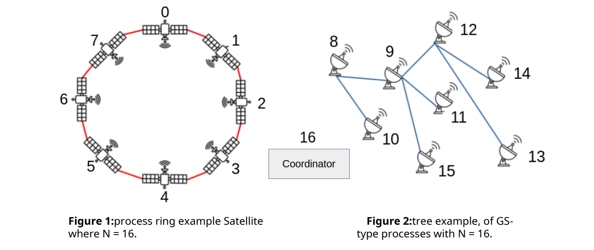
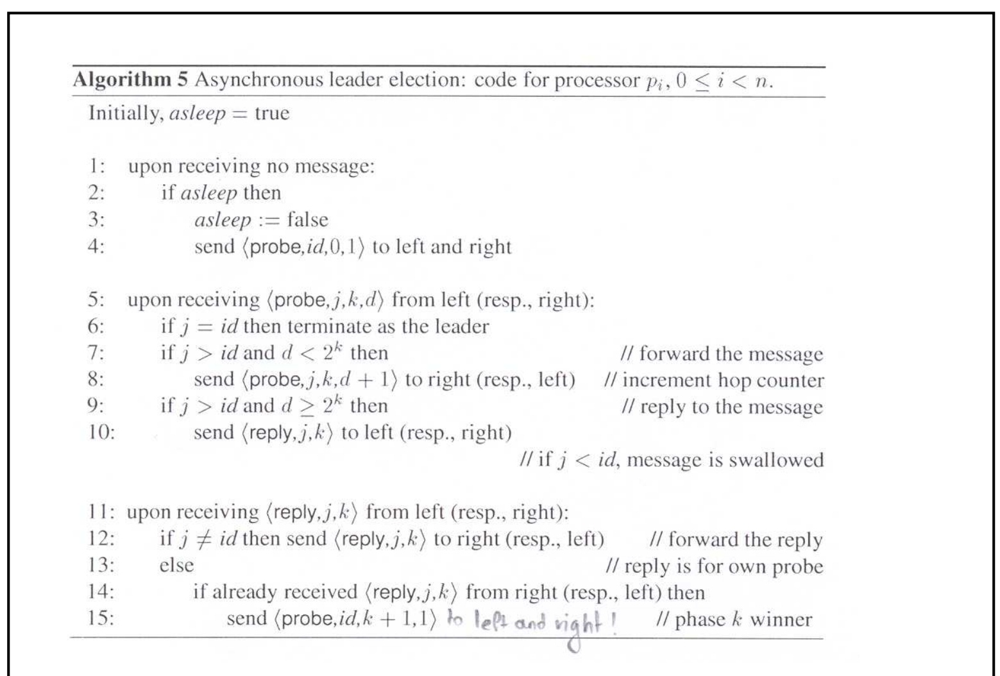
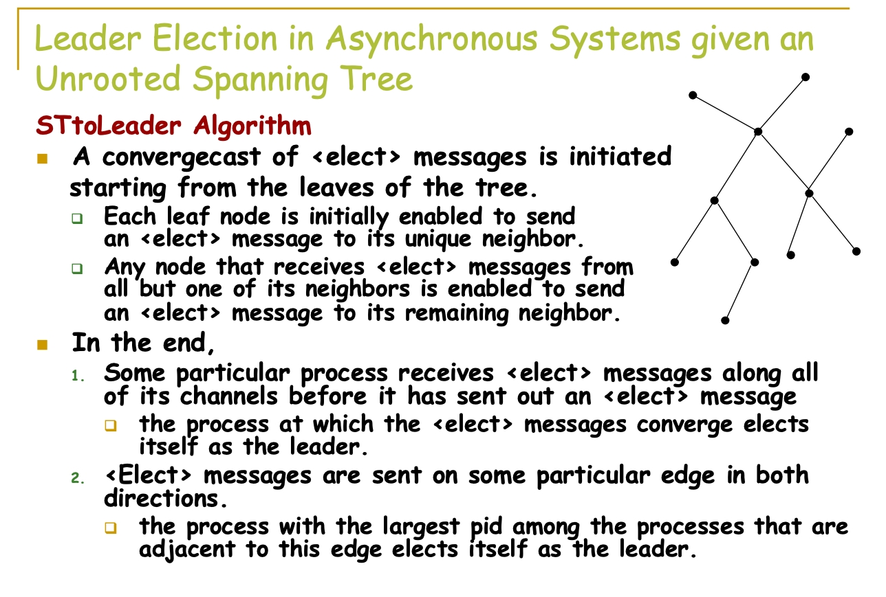
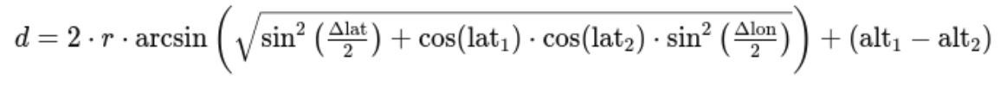

# Satellite to Ground Station Distributed System
A distributed satellite
communication system, where ground stations coordinate with satellites to exchange data
and execute commands. More specifically, satellites collect information that ground stations
are interested in. Ground stations are also interested in the proper operation of each
satellite.
This project is implemented in C using the Message Passing Interface
(MPI).

## Compilation
Simply run `make all` to compile the program or `make clean` to
remove all generated files.

## Running
You can run the program using `mpirun -np <N+1> ./stg_system <N> <path_to_input>.txt [-d]`
where `<N>` is the number of processes (minus the coordinator), `<path_to_input>` is the file
containing the commands and `-d` is an optional flag that displays debug print statements.

## System & Algorithms Description

The system consists of a **Coordinator** type process, `N/2` processes of type **Satellite** (satellites) and
`N/2` processes of type **Ground Station** (terrestrial stations).

The purpose of **Satellite** type processes is monitoring the temperature of planet earth. In
addition to the temperature measurement, each Satellite process stores a value (a
percentage) that characterizes its correct operation (Status). Finally, it has a position in
space, which is represented through the geographic coordinate system.

The **Ground Station** processes run on devices on the ground that communicate with the
satellites. More specifically, they are interested in the data collected by the satellites, as well
as the state of their proper operation. Like satellites, ground stations have a place on Earth.
This position is given by the geographic coordinate system.

In summary, each **Satellite** process is characterized by the following parameters, its
`identifier` (id) (mpi_rank), its `coordinates`,
coordinates[3] (latitude, longitude, altitude), its health `status`
(status), and a table of temperature measurement pairs in the format `<temperature , timestamp>`. Similarly, each **Ground Station** process is characterized by the
following parameters, its `identifier` (id) (mpi_rank) and its `coordinates`. For the sake of simplicity,
we consider that the coordinates array of each such process stores three components (with
elevation = 0). A **Ground Station** process also stores an array of pairs of the form
`<temperature measurement, time the measurement was taken>`, where each pair
characterizes a measurement the ground station received from a satellite.

Based on the above, the system should be configured as follows:
- There are `N+1` processes in the system, where the `N` is given as an input parameter to the system via a
command line argument and is an even-positive number.
- There is a process with an identifier of N which plays the role of the coordinator
- There are `N/2` Satellite processes, with IDs in the following range
``[0, (N/2)-1]``. Ground stations processes are also `N/2` in total and they have
identifiers in the range `[N/2, N-1]`. For example if N = 16, there are 17 processes in the system.
Satellite-type processes will have identifiers 0,1 .., 7, while ground station processes
have identifiers 8, ..., 15. Process 16 is the coordinator.
- The coordinator process (coordinator) reads a testfile that will contain the description
of various events that the rest of the processes must simulate and sends
corresponding messages to the appropriate processes to make this happen.
- Ground Stations request the execution of two types of requests, and
Satellite-type processes serve them. The first type of requests concerns
measurements of the Earth's temperature, while the second type concerns the
proper operation of a Satellite-type process.
- Every Satellite process maintains a structure with temperature measurements and
uses the measurements stored in this structure to answer the requests of Ground
Station type processes. The elements of the structure are determined by
`ADD_METRIC` type events, which are sent to them by the coordinator (and
simulate the measurement process).
- Every Ground Station process maintains a corresponding structure that stores the
average temperature received from the satellite processes for a certain timestamp.
This structure stores temperatures for several moments (according to testfile
events).
- Satellite processes are connected to each other in a ring topology (as shown in
Figure 1). Specifically, the ring is created as follows: Process j, 1 <= j <= N/2, has as
neighboring processes in the ring the processes with identifier `(j+1) %N/2` and `(j-1) % N/2`.
- Ground Stations form a tree, with no given root (see Figure 2 for an
example). The way these processes are interconnected is determined by the
coordinator, which reads and processes the testfile during system startup.
- One of the Satellite processes is elected leader as described in the next sections. Likewise, one of the Ground Station processes will be elected leader, as
described further below.



### Leader Election in Satellites
The ring leader election algorithm in based on the algorithm seen below. The algorithm
works in phases and has a communication complexity of **O(n logn)**. When the algorithm
terminates, the satellite leader sends a message of type `<LELECT_ST_DONE>` to the
coordinator to inform it that this satellite has been elected as leader.



### Leader Election in Ground Stations
The leader election algorithm for the Ground Station processes is depicted below this section. When a Ground Station gs process receives a message of type
`<START_LELECT_GS>` from the coordinator, it starts the leader election algorithm (by sending
a message of type `<ELECT>` to each of its neighbor nodes thus initiating the election process).

The ground station process that is elected leader informs the other ground
station processes that it has been elected leader and then sends to the coordinator process
a message of type `<LELECT_GS_DONE>` to inform it of the election processes' termination and what the Ground Station leader process is.



### Communication Events Description

#### Initialization Events

The coordinator process starts reading the testfile, which initially contains events that
define which processes have the role of Ground Station and at the same time describe the
connectivity of these processes, in order to create the tree that connects them
(without specifying any node as root). Specifically, these events take the following form:

- `CONNECT <ground_station_rank> <neighbor_rank>`: The coordinator first sends a `CONNECT` message to the process with ID
`<ground_station_rank>` to inform it that its parent node in the tree is the process with ID
`<neighbor_rank>`. The process with ID `<ground_station_rank>` sends the process with ID
`<neighbor_rank>` a message to inform it that it is a neighbor node. The process with ID
`<neighbor_rank>` registers it as one of its neighbors and sends it back an `ACK` message. When the
`<ground_station_rank>` process receives the `ACK` it in turn sends an `ACK` message to the
coordinator to inform it of the completion of the execution of this event.

For each of the above `<CONNECT>` messages, the coordinator process should wait
for an `<ACK>` message from the process to which it sent the message. This ensures that
all Ground Station processes know their role and connection in the Ground Stations tree so
that the system simulation can start smoothly.

Note: The coordinator process can have more than
one `CONNECT` message pending, but after processing all N/2 `CONNECT` type messages
contained in the test file, it waits for N/2 - 1 `ACK` type messages, before proceeding to
process another type of event in the testfile.

#### Leader Election Events
The test file contains an event of type `<START_ELECT_ST>`
which is followed by an event of type `<START_ ELECT_GS>`. Specifically, these events take the
following form:

- `<START_LELECT_ST>`: Upon execution of this event, the coordinator sends a message of type
`<START_LELECT_ST>` to each Satellite process that exists in the system and then
waits to receive a message of type `<LELECT_ST_DONE>` from the process who will be
elected leader. When this message is received, the coordinator process sends a
message of type `<ST_LEADER>` which contains the identifier of the satellite leader to all ground
station processes, informing them of the ID of the elected Satellite leader.

- `<START_LELECT_GS>`: Upon execution of such an event, the coordinator will send a press message<
START_LELECT_GS>in each type processGround Station that exists in the system and
then waits to receive a press message<LELECT_GS_DONE> from the process by which
the leader will be elected. When this message is received, the coordinator process sends
a message of type<GS_LEADER>which contains the id of the master-Ground_Station to
all Satellite-type processes, informing them of the ID of the elected Ground Station
leader.

The `<START_LELECT_ST>` and `<START_LELECT_GS>` events can be executed
simultaneously. However, the coordinator must receive both the `<LELECT_ST_DONE>`
and `<LELECT_GS_DONE>` messages from the respective Satellite and ground station leaders,
before continuing.

#### Reqeust Events
In addition, the test file also contains the following types of events:

- `ADD_METRIC <satellite_id> <temperature_metric> <timestamp>`: The coordinator constructs a message of type ADD_METRIC (which contains
<setallite_id>, <temperature_metric> and <timestamp>) and sends it to the process with
identifier <satellite_id>. The process with id <satellite_id> stores in its local metrics
structure the pair (<temperature_metric>, <timestamp>).
Intuitively this message simulates a temperature measurement with value
<temperature_metric> from the satellite with id
<satellite_id> at the time <timestamp>.
- `ADD_STATUS <satellite_id> <status>`: The coordinator creates a message of type ADD_STATUS (which contains the <satellite_id>
and <status>) and sends it to the process with identifier <satellite_id>. The process with
id <satellite_id> stores the <status> in a local variable. Intuitively,
this message represents a state of correctness regarding the satellite's operation (eg 99.8%).
- `ADD_ST_COORDINATES <satellite_id> <coordinates>`: The coordinator creates a message of type ADD_ST_COORDINATES (which contains
the <satellite_id> and <coordinates>) and sends it to process with identifier <satellite_id>.
The receiving process stores the coordinates given by
<coordinates>. <coordinates> is essentially the triplet of <lat>, <lon> and <alt>.
- `ADD_GS_COORDINATES <ground_station_id> <coordinates>`: The coordinator creates a message of type ADD_GS_COORDINATES (which contains
the <ground_station_id> and <coordinates>) and sends it to the process with identifier
<ground_station_id>. The receiving process stores the
coordinates given by <coordinates>.
- `STATUS_CHECK <satellite_id> <satellite_coordinates>`: The coordinator process sends a `<FIND_MIN_DIST>` to the leader process of the Ground Station
processes, lgs with the following information, <satellite_id> and
<satellite_coordinates>. The lgs process should perform a broadcast
algorithm to ensure that it is informed (via a convergecast protocol) of the
ground station process with the shortest distance from the satellite with id <satellite_id
> and <satellite_coordinates> coordinates. It
then notifies that process to handle the
request, using the tree. `min_gs` must send the request (STATUS_CHECK) to the
<satellite_id> process and wait for a response message, which contains its operational health status,
and stores this information.
- `AVG_EARTH_TEMP <timestamp>`: The coordinator process sends a `<AVG_EARTH_TEMP>` message to the leader process of the Ground Station processes. The Ground Station leader process
forwards the message to the Satellite leader process. When the leader Satellite process
receives the message, it will run an algorithm to calculate the average earth
temperature calculated by the satellite processes for the time <timestamp>. This
is done using a broadcast algorithm on the ring. Each process in the
ring that receives this broadcast message contributes to the average process
calculated so far (and contained in the message) and forwards the message with the
updated value to its next process. When the algorithm terminates, the Satellite leader
process sends to the Ground Station leader process a message of type `<AVG_EARTH_TEMP_DONE> <timestamp> <avg_temperature>`. The Ground Station
process stores this locally.
- `SYNC`: The Coordinator sends this message to all Ground Station processes. When a ground station process receives
this message, it sends a message to the leader Ground Station process (through the
tree) containing the number of STATUS_CHECKs it has performed. The leader process
counts the total of STATUS_CHECKs that have been performed and then prints this value
and sends it in a message to the coordinator. When it receives this message, the
coordinator also prints the value it received.
- `PRINT`: The Coordinator sends the message to the leader Ground Station process. The
leader process of the ground stations makes a broadcast with the message to the
ground stations tree. Each Ground Station type process that receives the message must
print to a file the status received from the Satellite type processes. The file will be
unique for each process.
More specifically, the format of the file should be the following:
```
➢ satellite <satellite_rank>: <status>
➢ . .
➢ satellite <satellite_rank>: <status>
➢ satellite <satellite_rank>: <status>
```
The Ground Station leader process also prints the temperature readings it
received. In this case the format of the file should be the following:
```
➢ <timestamp>, <avg_temp>
➢ <timestamp>, <avg_temp>
➢ . .
➢ <timestamp>, <avg_temp>
```

#### Termination Event
When the coordinator process finishes reading the testfile, it waits for all other
processes to complete their pending message exchanges. So, when all the system events
are completed, it shuts down the system safely. Specifically, before terminating itself, it
sends a message of type `<TERMINATE>` to all other processes so that it informs them of the
shutdown of the system.

### Geographic Coordinate System
The geographic coordinate system consists of the following coordinates: latitude (Latitude -
Lat), longitude (Longitude - Lon), and altitude (Altitude - Alt). Coordinates (Lat, Lon) give us a
point on the surface of the Earth, while Alt gives us the distance from the surface of the
Earth upwards. Since ground stations are on the ground they will have Alt = 0.

To calculate two points in the geographic coordinate system we use the
**Haversine** formula seen below:

